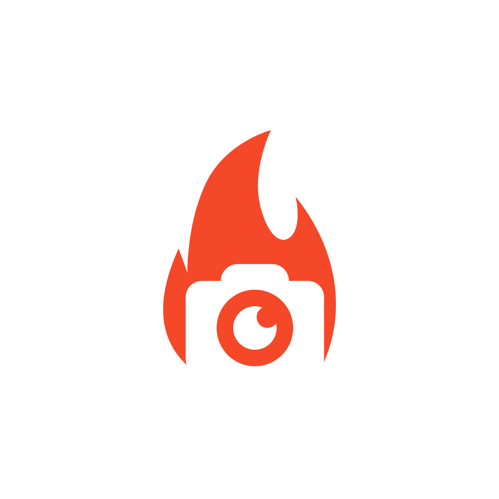

<!-- Improved compatibility of back to top link: See: https://github.com/othneildrew/Best-README-Template/pull/73 -->
<a name="readme-top"></a>
<!--
*** Thanks for checking out the Best-README-Template. If you have a suggestion
*** that would make this better, please fork the repo and create a pull request
*** or simply open an issue with the tag "enhancement".
*** Don't forget to give the project a star!
*** Thanks again! Now go create something AMAZING! :D
-->


<!-- PROJECT SHIELDS -->
<!--
*** I'm using markdown "reference style" links for readability.
*** Reference links are enclosed in brackets [ ] instead of parentheses ( ).
*** See the bottom of this document for the declaration of the reference variables
*** for contributors-url, forks-url, etc. This is an optional, concise syntax you may use.
*** https://www.markdownguide.org/basic-syntax/#reference-style-links
-->
[![Contributors][contributors-shield]][contributors-url]
[![Forks][forks-shield]][forks-url]
[![Stargazers][stars-shield]][stars-url]
[![Issues][issues-shield]][issues-url]
[![MIT License][license-shield]][license-url]
<!-- [![LinkedIn][linkedin-shield]][linkedin-url] -->


<!-- PROJECT LOGO -->
<br />
<div align="center">
  <a href="https://github.com/gramos93/xenon-crow">
    
  </a>

<h3 align="center">Computer-Aided Labelling for Inspection (CALI)</h3>

  <p align="center">
    The preventive assessment and maintenance of large infrastructures is one of the arduous responsibilities of governments and private infrastructure owners. Not only relating to the infrastructure usability but also public safety and legal liability, the assessment of infrastructures is done mainly manually by certified inspectors. Nevertheless, due to the high cost and inefficiency of manual inspection, the research and development in the field of automated inspection (NDT4.0) is growing rapidly. Indeed, propelled by the last decade's improvements to small drones, multi-modal image acquisition technology, computer-vision and deep learning, inspectors are collecting and analyzing more data than ever before. In order to ease the introduction of deep learning techniques in inspection scenarios, we propose a Computer-Aided Labelling for Inspection (CALI) tool geared towards assisting inspectors, i) analyze and understand the data faster, ii) generate region of interest (ROI) annotations more efficiently and iii) reduce bias due to the subjective nature of manual inspection. We formulate the annotation problem following a multi-agent Markov Decision Process (MDP), where the agent and the inspector collaborate, through priors and corrections, in order to conquer the annotation tasks at hand. At it's core, the agent benefits from a semi-supervised super-pixel segmentation network and the whole process is optimized using the Duelling Double Deep Q-Network (D3QN) framework. We demonstrate the performance and generality of our method in two infrared thermography inspection dataset, the first collected in a controlled environment with laboratory samples and the second collected during a real bridge inspections scenario.
    <br />
    <!-- <a href="https://github.com/gramos93/xenon-crow"><strong>Explore the docs »</strong></a> -->
    <!-- <br /> -->
    <br />
    <a href="https://github.com/gramos93/xenon-crow/issues">Report Bug</a>
    ·
    <a href="https://github.com/gramos93/xenon-crow/issues">Request Feature</a>
  </p>
</div>


<!-- TABLE OF CONTENTS -->
<details>
  <summary>Table of Contents</summary>
  <ol>
    <li>
      <a href="#screenshot">Screenshot</a>
      <ul>
        <li><a href="#built-with">Built With</a></li>
      </ul>
    </li>
    <li>
      <a href="#getting-started">Getting Started</a>
      <ul>
        <li><a href="#prerequisites">Prerequisites</a></li>
        <li><a href="#installation">Installation</a></li>
      </ul>
    </li>
    <li><a href="#usage">Usage</a></li>
    <li><a href="#license">License</a></li>
    <li><a href="#contact">Contact</a></li>
    <li><a href="#acknowledgments">Acknowledgments</a></li>
  </ol>
</details>


<!-- ABOUT THE PROJECT -->
## Screenshot

[![Product Name Screen Shot][product-screenshot]](https://example.com)

<!-- Here's a blank template to get started: To avoid retyping too much info. Do a search and replace with your text editor for the following: `gramos93`, `xenon-crow`, `twitter_handle`, `linkedin_username`, `ulaval.ca`, `gabriel.ramos.1`, `Xenon-Crow`, `Automatic thermal\IR imaging labeling software. Powered by semi-supervised semantic segmantation and Deep-RL.` -->

<p align="right">(<a href="#readme-top">back to top</a>)</p>


### Built With

<!-- * [![Next][Next.js]][Next-url]
* [![React][React.js]][React-url]
* [![Vue][Vue.js]][Vue-url]
* [![Angular][Angular.io]][Angular-url]
* [![Svelte][Svelte.dev]][Svelte-url]
* [![Laravel][Laravel.com]][Laravel-url]
* [![Bootstrap][Bootstrap.com]][Bootstrap-url]
* [![JQuery][JQuery.com]][JQuery-url] -->
[![Python][python.org]][Python-url] [![Pytorch][pytorch.org]][Pytorch-url] [![sklearn][sklearn.org]][sklearn-url]

<p align="right">(<a href="#readme-top">back to top</a>)</p>


<!-- GETTING STARTED -->
## Getting Started

To get started using the Computer-Aided Labelling for Inspection (CALI) tool you'll need a Python 3.8+ installation, which is the default Python version on Ubuntu 20.04. 

### Prerequisites

* Python (On Ubuntu)
  ```sh
  sudo apt install python3 python3-pip
  ```

### Installation

1. Clone the repo
   ```sh
   git clone https://github.com/gramos93/xenon-crow.git
   cd ./xenon-crow
   ```
2. Install the Python dependencies with pip packages
   ```sh
   pip install -r requirements.txt
   ```

<p align="right">(<a href="#readme-top">back to top</a>)</p>


<!-- USAGE EXAMPLES -->
## Usage

In order to start a training session on the provided dataset first download it from here. Un-compress the dataset folder in the `./data` folder inside the xenon-crow repo you just cloned.

1. Training an agent
   ```sh
   python ./xenon-crow/main.py {d3qn, reinforce, a2c}
   ```
2. The hyperparameters are place in the beggining of the `main.py` script and they can be changed from there before running the training.
   ```python
    seed = 42
    MAX_EP = 100

    GAMMA = 0.99
    LR = 1e-4
    TAU = 1e-3
    EPS = 1.0

    TRAIN_INTER = 4
    BUFFER_SIZE = 400
    BATCH_SIZE = 64
   ```
 3. Path for training images, ground truth, states
    ```sh
     xenon-crow\data\train\imgs
     xenon-crow\data\train\masks\gt
     xenon-crow\data\train\masks\states
    ```
4. Annotation tool to make data sets
    ```python
   python label_maker.py
   ```

<p align="right">(<a href="#readme-top">back to top</a>)</p>


<!-- ROADMAP -->
<!-- ## Roadmap

- [ ] Feature 1
- [ ] Feature 2
- [ ] Feature 3
    - [ ] Nested Feature

See the [open issues](https://github.com/gramos93/xenon-crow/issues) for a full list of proposed features (and known issues).

<p align="right">(<a href="#readme-top">back to top</a>)</p> -->


<!-- CONTRIBUTING -->
<!-- ## Contributing

Contributions are what make the open source community such an amazing place to learn, inspire, and create. Any contributions you make are **greatly appreciated**.

If you have a suggestion that would make this better, please fork the repo and create a pull request. You can also simply open an issue with the tag "enhancement".
Don't forget to give the project a star! Thanks again!

1. Fork the Project
2. Create your Feature Branch (`git checkout -b feature/AmazingFeature`)
3. Commit your Changes (`git commit -m 'Add some AmazingFeature'`)
4. Push to the Branch (`git push origin feature/AmazingFeature`)
5. Open a Pull Request

<p align="right">(<a href="#readme-top">back to top</a>)</p> -->


<!-- LICENSE -->
## License

Distributed under the MIT License. See `LICENSE.txt` for more information.

<!-- CONTACT -->
## Contact

Gabriel Ramos - gabriel.ramos.1@ulaval.ca
<br>
Kevin Laurent - kevin.laurent.1@ulaval.ca

Project Link: [https://github.com/gramos93/xenon-crow](https://github.com/gramos93/xenon-crow)


<!-- ACKNOWLEDGMENTS -->
## Acknowledgments

* [TORNGATS](https://torngats.ca)
* [University Laval](https://ulaval.ca/en)

<p align="right">(<a href="#readme-top">back to top</a>)</p>


<!-- MARKDOWN LINKS & IMAGES -->
<!-- https://www.markdownguide.org/basic-syntax/#reference-style-links -->
[contributors-shield]: https://img.shields.io/github/contributors/gramos93/xenon-crow.svg?style=for-the-badge
[contributors-url]: https://github.com/gramos93/xenon-crow/graphs/contributors
[forks-shield]: https://img.shields.io/github/forks/gramos93/xenon-crow.svg?style=for-the-badge
[forks-url]: https://github.com/gramos93/xenon-crow/network/members
[stars-shield]: https://img.shields.io/github/stars/gramos93/xenon-crow.svg?style=for-the-badge
[stars-url]: https://github.com/gramos93/xenon-crow/stargazers
[issues-shield]: https://img.shields.io/github/issues/gramos93/xenon-crow.svg?style=for-the-badge
[issues-url]: https://github.com/gramos93/xenon-crow/issues
[license-shield]: https://img.shields.io/github/license/gramos93/xenon-crow.svg?style=for-the-badge
[license-url]: https://github.com/gramos93/xenon-crow/blob/master/LICENSE.txt
[linkedin-shield]: https://img.shields.io/badge/-LinkedIn-black.svg?style=for-the-badge&logo=linkedin&colorB=555
[linkedin-url]: https://linkedin.com/in/linkedin_username
[product-screenshot]: assets/screenshot.png
[Next.js]: https://img.shields.io/badge/next.js-000000?style=for-the-badge&logo=nextdotjs&logoColor=white
[Next-url]: https://nextjs.org/
[React.js]: https://img.shields.io/badge/React-20232A?style=for-the-badge&logo=react&logoColor=61DAFB
[React-url]: https://reactjs.org/
[Vue.js]: https://img.shields.io/badge/Vue.js-35495E?style=for-the-badge&logo=vuedotjs&logoColor=4FC08D
[Vue-url]: https://vuejs.org/
[Angular.io]: https://img.shields.io/badge/Angular-DD0031?style=for-the-badge&logo=angular&logoColor=white
[Angular-url]: https://angular.io/
[Svelte.dev]: https://img.shields.io/badge/Svelte-4A4A55?style=for-the-badge&logo=svelte&logoColor=FF3E00
[Svelte-url]: https://svelte.dev/
[Laravel.com]: https://img.shields.io/badge/Laravel-FF2D20?style=for-the-badge&logo=laravel&logoColor=white
[Laravel-url]: https://laravel.com
[Bootstrap.com]: https://img.shields.io/badge/Bootstrap-563D7C?style=for-the-badge&logo=bootstrap&logoColor=white
[Bootstrap-url]: https://getbootstrap.com
[JQuery.com]: https://img.shields.io/badge/jQuery-0769AD?style=for-the-badge&logo=jquery&logoColor=white
[JQuery-url]: https://jquery.com 
[Python.org]: https://img.shields.io/badge/python-0769AD?style=for-the-badge&logo=python&logoColor=yellow
[Python-url]: https://python.org
[Pytorch.org]: https://img.shields.io/badge/pytorch-0769AD?style=for-the-badge&logo=pytorch&logoColor=red
[Pytorch-url]: https://pytorch.org
[sklearn.org]: https://img.shields.io/badge/sklearn-0769AD?style=for-the-badge&logo=scikit-learn&logoColor=white
[sklearn-url]: https://scikit-learn.org
[openai.com]: https://img.shields.io/badge/openai-0769AD?style=for-the-badge&logo=openai&logoColor=black
[openai-url]: https://openai.com
